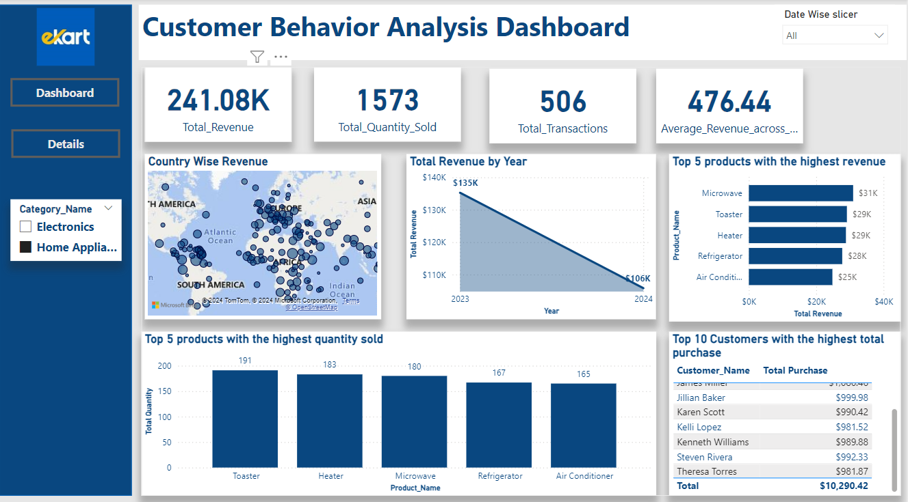

# Customer Behavior Analysis

## Overview 

This project focuses on analyzing customer purchase behavior to uncover valuable insights that can drive business decision-making. By utilizing SQL, Excel, Python, and Power BI, I built an end-to-end system that identifies customer purchase patterns, tracks key performance indicators (KPIs), and generates insightful reports.

## Technologies Used

- SQL: For querying and manipulating the database to extract relevant purchase data.
- Python: For data analysis, statistical modeling, and automation of data workflows.
- Excel: For initial data cleaning and exploratory analysis.
- Power BI: For visualizing the data and creating interactive reports.

## Objectives

- Analyze customer purchase patterns to understand buying behaviors.
- Identify key performance indicators (KPIs) that impact sales and customer retention.
- Generate comprehensive reports that assist in strategic business planning.

## Features
- Data Extraction: Automated extraction of purchase data from the database using SQL.
- Data Analysis: Utilized Python to perform in-depth analysis and identify trends and patterns.
- Data Visualization: Created interactive dashboards in Power BI to visualize KPIs and customer segments.
- Reporting: Generated insightful reports for stakeholders to facilitate informed decision-making.

### PowerBI Report

## Conclusion

This project has equipped me with a deeper understanding of customer purchase behaviors and the tools necessary to analyze data effectively. The insights gained from this analysis can be leveraged to enhance marketing strategies, improve customer engagement, and ultimately drive sales growth
